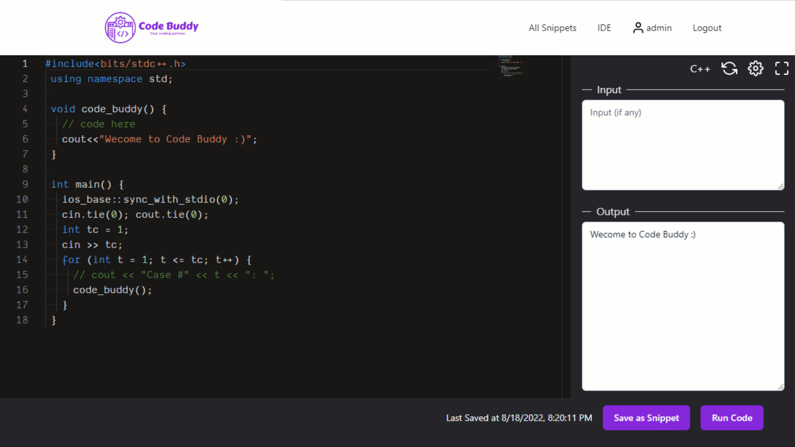
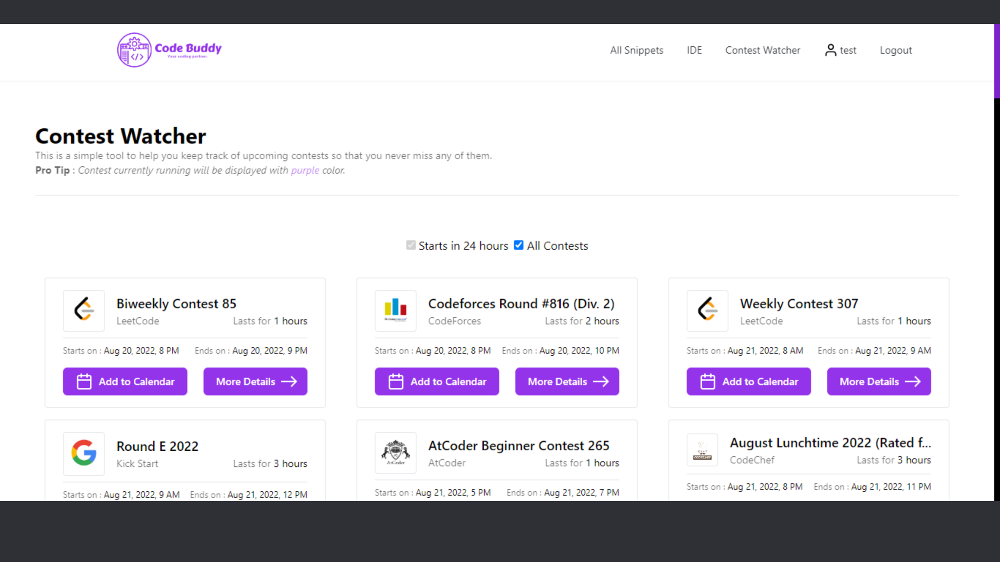
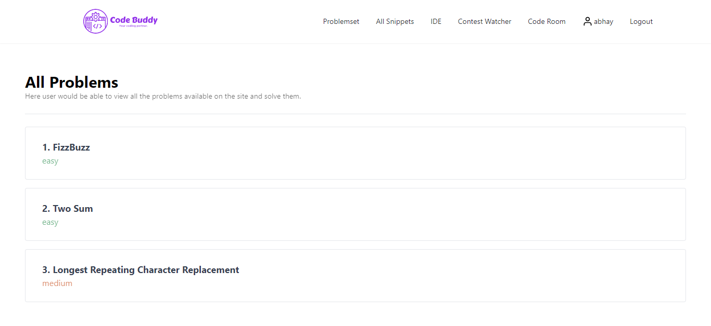
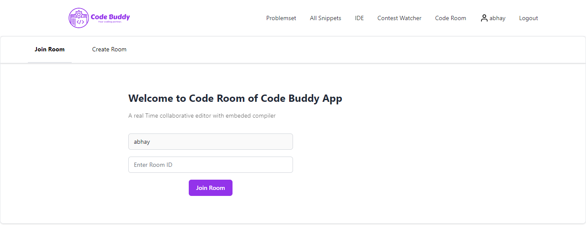

    
<i>Code Buddy is your all-in-one Coding platform, which includes numerous micro-services like Code Runner, Code sharing and Contest Watcher that is intended to assist Competitive Programming enthusiasts.</i>
 
 

  
  
  
  

 

Deployed Backend(server) URL - <a href="https://code-buddybackend.herokuapp.com/">https://code-buddybackend.herokuapp.com/</a>

<h2>Live Preview</h2>
Frontend Deploy Link - <a href="https://codebuddyapp.netlify.app/">https://codebuddyapp.netlify.app/</a>
 
<h4>IDE</h4>
Run your code online in 40+ languages using Code Runner.

 
<h4>Contest Watcher</h4>
Never miss your online coding contests.

 
 
<h4>Problemset</h4>
Solve problems online and share your code with the world.

<h4>Code Room</h4>
Online room for collaborating on code.

 

<h2>👩‍💻 Tech Stack </h2>
<b>Frontend</b> - HTML5, CSS3, JS, Axios, TailwindCSS, Reactjs 
<b>Backend</b> - Nodejs, Expressjs, MongoDB 
<b>Tools</b> - Netlify, Heroku, Git, VS Code, Postman 

<h2>📝 Contribution </h2>
This repo is open to contribution and modifications, 
- <b>Star</b> this Repository. 
- <b>Fork</b> this Repository. 
- <b>Clone</b> this Repository from your Github to Local Machine. 
- Create a <b>New Branch</b> and do edits. 
- <b>Push</b> to origin. 
- Create <b>Pull Request to this Repository</b>. 

## ⏳ Future Scope
    
   1. Implementation of the collaborative code editor.
   2. Statement of the problem, submission of the code, and checking of the code.
   3. Better UI for the App 

<b><i>Star this Repository and you can visit to my profile and see some more Projects like this.</i></b>
 
*Mail me at <a href="mailto:hi+CpBuddy@abhaygupta.me">hi@abhaygupta.me</a> for any collaboration or queries.*
